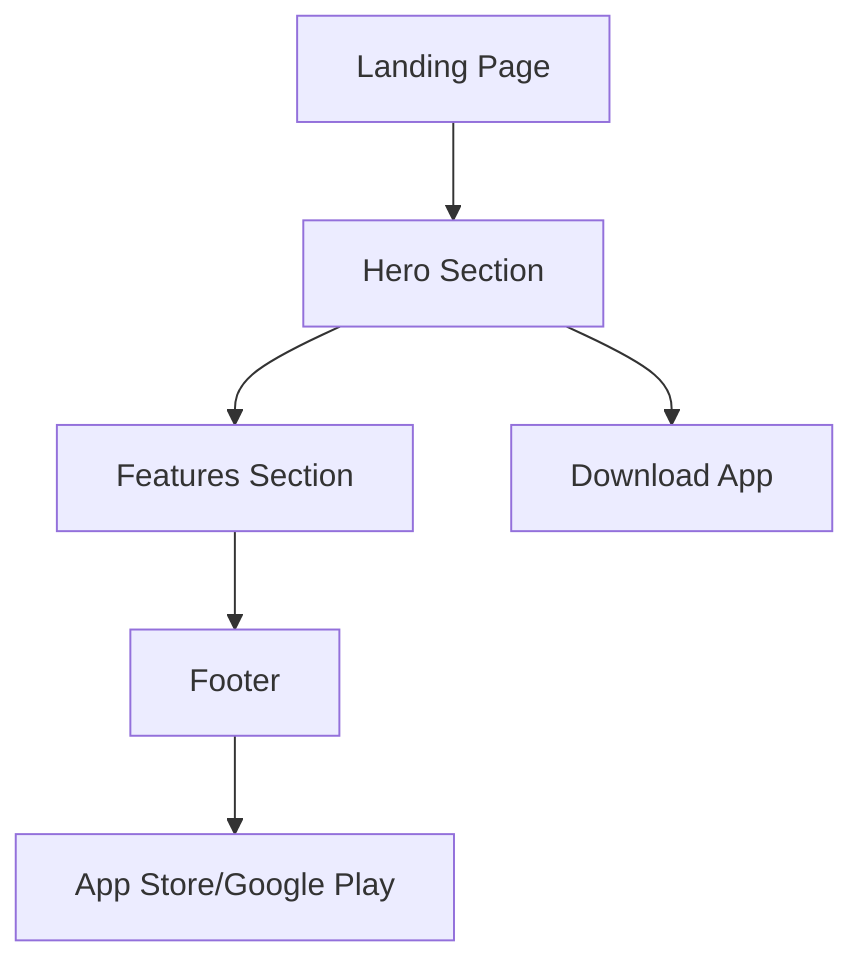

## 1. Product Overview
Landing page para Habitto - una aplicación de alquiler de viviendas en Santa Cruz. La página presenta la propuesta de valor principal: encontrar tu próximo hogar con un swipe, conectando directamente con propietarios sin comisiones.

La landing page debe transmitir confianza, modernidad y simplicidad, mostrando las características clave del servicio y facilitando la descarga de la aplicación.

## 2. Core Features

### 2.1 User Roles
No aplica - Landing page informativa sin registro de usuarios.

### 2.2 Feature Module
La landing page de Habitto consiste en las siguientes secciones principales:
1. **Header**: Navegación principal con logo y botón de descarga
2. **Hero Section**: Mensaje principal con CTA y mockup del móvil
3. **Features Section**: Tres tarjetas destacando beneficios clave
4. **Footer**: Enlaces a tiendas de apps y redes sociales

### 2.3 Page Details
| Page Name | Module Name | Feature description |
|-----------|-------------|---------------------|
| Header | Logo/Brand | Mostrar logo de Habitto con icono de doble chevron en color primario |
| Header | Navigation | Links a Features, How it Works, Contact con hover effects |
| Header | CTA Button | Botón "Download App" con estilo primary/action color |
| Hero Section | Main Headline | Título "Encuentra tu próximo hogar con un Swipe" en tipografía bold |
| Hero Section | Subheadline | Descripción "La forma inteligente y segura de alquilar en Santa Cruz" |
| Hero Section | Primary CTA | Botón principal "Descarga la App" con gradiente pink-purple |
| Hero Section | Phone Mockup | Imagen 3D de iPhone mostrando interfaz de la app |
| Features Section | Section Title | "Todo lo que necesitas, en un solo lugar" |
| Features Section | Feature Card 1 | Matching Inteligente con icono auto_awesome |
| Features Section | Feature Card 2 | Sin Comisiones con icono payments |
| Features Section | Feature Card 3 | Roomies Seguros con icono verified_user |
| Footer | Store Badges | Botones de descarga para App Store y Google Play |
| Footer | Social Links | Iconos de Instagram, Facebook y LinkedIn |
| Footer | Copyright | Texto "© 2024 Habitto. All rights reserved." |

## 3. Core Process
**Flujo del Usuario:**
1. Usuario llega a la landing page
2. Visualiza el hero con el mensaje principal y el mockup del móvil
3. Explora las características principales
4. Hace clic en los botones de descarga para obtener la app

## 4. User Interface Design

### 4.1 Design Style
- **Colores Primarios**: #EC4A7E (pink), #9C55CC (purple), #5C74F0 (blue/action)
- **Colores de Fondo**: #0A050F (dark), #F5F7FA (light - para futuros temas)
- **Estilo de Botones**: Rounded-full con gradientes y hover effects
- **Tipografía**: Manrope (display), varios pesos (400, 700, 800)
- **Layout**: Glassmorphism con backdrop blur, bordes translúcidos
- **Iconos**: Material Symbols Outlined con variaciones de fill

### 4.2 Page Design Overview
| Page Name | Module Name | UI Elements |
|-----------|-------------|-------------|
| Header | Navigation Bar | Glassmorphism, rounded-full, backdrop-blur-20, border translúcido |
| Hero Section | Main Card | Glassmorphism con padding generoso, bordes redondeados xl |
| Hero Section | CTA Button | Gradient pink-purple, hover con glow effect y scale transform |
| Features Section | Feature Cards | Glassmorphism, iconos en círculos con background colorido |
| Footer | Footer Container | Glassmorphism rounded-t-xl, contenido centrado |

### 4.3 Responsiveness
- Desktop-first approach
- Breakpoints: md (768px), lg (1024px), xl (1280px)
- Contenedor máximo de 6xl (1152px) para contenido principal
- Grid responsive para feature cards (1 columna móvil, 3 columnas desktop)

### 4.4 Efectos Especiales
- **Aurora Background**: Tres blobs difuminados con colores primarios
- **Glassmorphism**: Cards semi-transparentes con backdrop blur
- **Gradient Animations**: Hover effects en botones principales
- **Drop Shadows**: En imágenes principales para profundidad