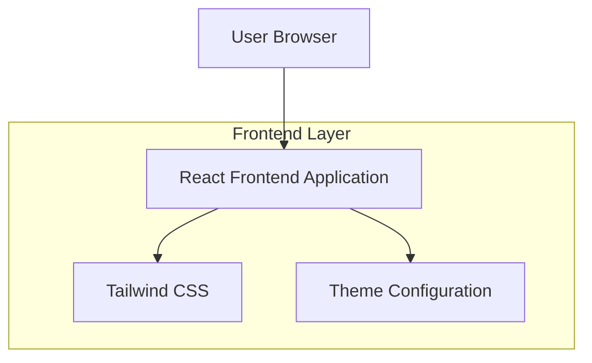

## 1. Architecture design



## 2. Technology Description

- **Frontend**: React@18 + tailwindcss@3 + vite
- **Initialization Tool**: vite-init
- **Build Tool**: Vite
- **Styling**: Tailwind CSS with custom theme configuration
- **Icons**: Material Symbols Outlined from Google Fonts
- **Backend**: None - Landing page estática

## 3. Route definitions

| Route | Purpose |
|-------|---------|
| / | Landing page principal con todas las secciones |

## 4. Estructura de Componentes

### 4.1 Componentes Principales
- `App.jsx` - Componente raíz
- `components/Header.jsx` - Navegación principal
- `components/HeroSection.jsx` - Sección hero con CTA
- `components/FeaturesSection.jsx` - Tres tarjetas de características
- `components/Footer.jsx` - Footer con enlaces
- `styles/theme.js` - Configuración de colores y estilos

### 4.2 Configuración de Tailwind
```javascript
// tailwind.config.js
export default {
  darkMode: "class",
  theme: {
    extend: {
      colors: {
        primary: "#EC4A7E",
        secondary: "#9C55CC", 
        action: "#5C74F0",
        highlight: "#FFFFD0",
        "background-light": "#F5F7FA",
        "background-dark": "#0A050F",
      },
      fontFamily: {
        display: ["Manrope", "sans-serif"]
      },
      borderRadius: {
        DEFAULT: "1rem",
        lg: "2rem", 
        xl: "3rem",
        full: "9999px"
      }
    }
  }
}
```

### 4.3 Estilos CSS Personalizados
```css
/* Glassmorphism styles */
.glassmorphism {
  background-color: rgba(255, 255, 255, 0.1);
  backdrop-filter: blur(20px);
  -webkit-backdrop-filter: blur(20px);
  border: 1px solid rgba(255, 255, 255, 0.15);
}

/* Aurora background */
.aurora-background {
  position: absolute;
  top: 0;
  left: 0;
  right: 0;
  bottom: 0;
  width: 100%;
  height: 100%;
  overflow: hidden;
  z-index: -1;
}

.aurora-blob {
  position: absolute;
  filter: blur(120px);
  opacity: 0.25;
}

/* CTA gradient with hover */
.cta-gradient {
  background-image: linear-gradient(to right, #EC4A7E, #9C55CC);
  transition: all 0.3s ease-in-out;
}

.cta-gradient:hover {
  box-shadow: 0 0 20px 0 rgba(156, 85, 204, 0.6);
  transform: scale(1.02);
}
```

## 5. Dependencias del Proyecto

```json
{
  "dependencies": {
    "react": "^18.2.0",
    "react-dom": "^18.2.0"
  },
  "devDependencies": {
    "@vitejs/plugin-react": "^4.0.0",
    "autoprefixer": "^10.4.14",
    "postcss": "^8.4.24",
    "tailwindcss": "^3.3.0",
    "vite": "^4.3.9"
  }
}
```

## 6. Estructura de Archivos

```
src/
├── components/
│   ├── Header.jsx
│   ├── HeroSection.jsx
│   ├── FeaturesSection.jsx
│   └── Footer.jsx
├── styles/
│   ├── index.css
│   └── theme.js
├── assets/
│   └── images/
├── App.jsx
└── main.jsx
public/
└── index.html
```

## 7. Optimizaciones

- **Imágenes**: Usar imágenes optimizadas para web
- **Fuentes**: Cargar desde Google Fonts con display=swap
- **CSS**: Tailwind JIT compilation para solo incluir clases usadas
- **Bundle**: Vite code splitting y tree shaking automático